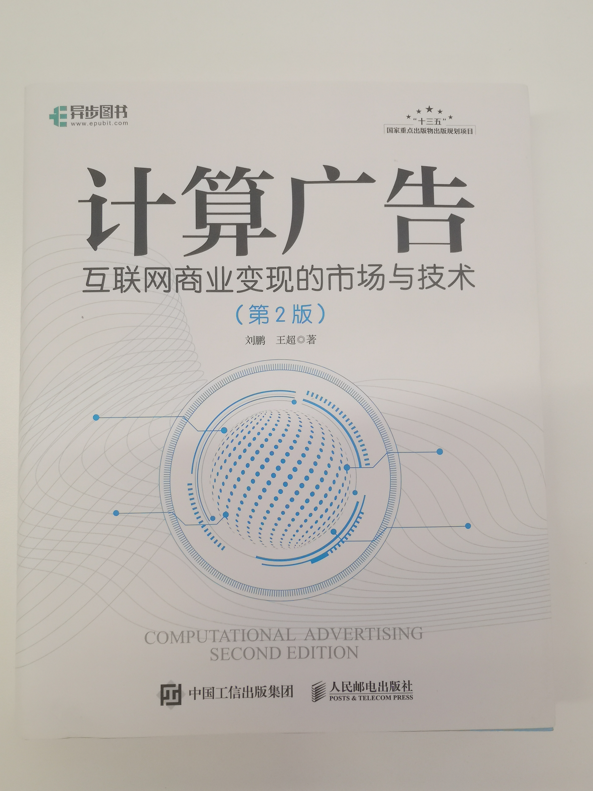

# 刘鹏《计算广告》读书笔记

读书笔记目录[在此](https://zhuanlan.zhihu.com/p/295370555)。  

我虽然是搞技术的，但读技术类书籍非常少，读人文历史类居多。  
毕竟我干这行，最初只是为了糊口，并没有太多的热爱。  

计算广告是支撑整个互联网帝国的基石，这本书也在国内称得上脍炙人口。  
所以这次决定认真学习一下。  

## 目录
- [刘鹏《计算广告》读书笔记](#刘鹏计算广告读书笔记)
  - [目录](#目录)
  - [更新日志](#更新日志)
  - [开篇的闲扯](#开篇的闲扯)
  - [序言](#序言)
  - [第一部分 在线广告市场与背景](#第一部分-在线广告市场与背景)
    - [第1章 在线广告综述](#第1章-在线广告综述)

## 更新日志

|修改人|修改日期|修改内容|
|-|-|-|
|朱里|2021.08.25|阅读第一部分，第1章。|

## 开篇的闲扯

想到再写吧。  

## 序言

开篇的序和前言部分包含了业界、学界人士的评价。  
这本书的一个**典型意义**，是作为国内第一本系统探讨计算广告这门学问，并可用于教学的书籍。  

全书的定位以**科普为主**，因此完全适合**非技术背景**的同学学习，以便了解互联网行业的全貌。  

## 第一部分 在线广告市场与背景

### 第1章 在线广告综述

数据是信息时代的最核心资产，这个不言而喻。  

流量，其实可以理解为**流动的数据**。  
因为你的联网行为，其实也是以数据交互的形式存在。  

影响力，这个才是流量时代的第一个摇钱树。  
开始我们发现“明星”这个概念开始走下神坛；后来我们逐渐明白，当初的**神坛**已经变成了**广场**。  
既然是广场，那么大妈也能上去跳舞了。  
**网红经济**由此诞生。  

以**图论**的思维看影响力，无非是**入度**和**出度**。  
对有向图来说：
- 如果以注意力为边，则入度大的点是热点，受人关注。  
- 如果以话语权为边，则出度大的点是热点，输出观点。  

第2节聊大数据，提到了“行为数据”和“全量加工”。  
计算广告从诞生起就和**批处理**、**流计算**紧密相关。  
其中流计算中的**流表、维表**就和上面两个概念有关。  

本节提到的AB两类问题，技术同学应该有比较直观的感受。  
随便来几个举例：
- 统计一个文件夹下所有文件的大小。
  - 属于A类问题。
  - 这个可以通过异步计算 + 采样实现，精度有损失，但效果无伤大雅。
- 机器学习训练中，计算高维向量的softmax转换结果。
  - 属于A类问题。
  - 经典的**负采样思想**的运用。
- 舆情监控系统，掌握当前行政区划的事故伤亡情况。
  - 属于B类问题。
  - 物理统计手段的延迟、误差无法避免，但数字层面必须精确。
- 天文、军用控制系统的导航类、聚合类计算。
  - 属于B类问题。
  - 行业属性和应用要求使然，误差容忍度极低。

**自动化**是一切智能系统的出发点。  
所谓**人工智能**，并不是类人、更不是类脑。  
而是自动化的决策，循序渐进来看，自然就先以**辅助决策**为目标。  

从MapReduce诞生，大数据时代正式开始。  
随后大数据思维带来了**数据科学**和**数据驱动决策**。  
目前AI风头正盛，也有了AI驱动决策，各领风骚。  
从计算广告来看，我们要决策的，自然是广告的投放策略、变现路径。  
不论大数据、AI，都脱胎与计算机科学，因此叫“计算广告”。  

一句话概念复习：
|概念|理解|
|-|-|
|横幅广告|顾名思义，页眉页脚区域的大长条广告。|
|文字链广告|超链接广告。|
|富媒体广告|图文并茂。|
|视频广告|视频网站穿插，或者CDN静态托管。|
|交互式广告|移动端更常见，比如手游广告。|
|社交广告|其实理解成**植入式广告**更合适，和周边内容形式一致，避免违和感。|
|移动广告|移动端的广告。|
|邮件营销广告|你就说**垃圾邮件**得了。|
|激励广告|这其实是种策略，比如折扣、返利。|
|团购|这也是种商业模式，不是广告形式。|
|游戏联运|游戏行业的运营分润模式。|
|固定位导航|互联网行业早期的黄页导航。|

第5节的内容短小精悍，作为整本书的**开胃菜**很合适。  

首先从早期没有个性化的数字广告投放作为起点，引入了用技术手段满足广告营销的**供需平衡**的问题。  
然后针对“个性化”开始往技术、算法、商业思维方面去引导读者。  

比如这句：  
“因此，最初的定向标签往往是人口属性等粒度较粗的标签。”  
这是个典型的ML问题，也就是我们建模时考虑的首要问题：
- 这是什么问题？分类？回归？分类是多分类、多标签还是多级分类。
- 特征如何采集，要不要采样 or 聚合？
- 粒度粗细如何把握？粗了偏差大，细了过拟合。

在ML尚未恢复其热度以前，做计算广告的**推荐算法工程师**（没错，不炼丹的算法工程师）就已经在用各种**运筹优化**和**专家规则**去处理这些问题了。  
所以这些人一般以“做策略的”自居。  

一提到**竞价广告**，大家想到的都是万恶之源、垄断资本的摇钱树等等负面评价。  
然而如果你是学经济的，肯定知道**拍卖理论**是一个重要且严肃的研究分支。  
重要在哪儿？定价模型和交易模型。  

广告主、媒体、代理、受众四方，在整个广告投放变现的过程中进行博弈。  
博弈论正好也是**经济学**的研究分支之一。  
因此我们读《计算广告》，把绝大多数精力放在**计算机科学**以外就行了。  

行业从萌发到壮大，有些思维和趋势可以类推。  

广告也是一样：
- 自己做自己投放。
- 别人做自己买了投放。
- 自己做卖给别人投放。
- 广告代理诞生，第三方投放。
- 代理做大做强，广告交易的诞生。
- 广告联盟诞生，交易规模化并开始联动。
- 交易模式创新，纯toB开始走向toC。
- ...

以上只是类比金融业从诞生到今天的一些发展轨迹。  
毕竟不变的是人性，所以围绕**人类社会**的**生产活动**，这种发展变化是历史必然。  

比如本节中提到的担保式投放，就是个典型的**风险对冲**行为，相当于以旱涝保收为目的的**期货**。  
盈利诉求、风险偏好等，都是决定这个交易模型的因素。  

RTB的诞生让我们看到的股市的影子，这也是从B到C的一个关键转折。  
B和C都有了，“搞活”二字也就做到了。  
因为要搞活一个行业，必然要让**最广大**的群体**带着利益**参与进来。  

此处除了类比，还要明白一些差异。  
比如实时竞价从一开始，就是**程序化、数字化**的。 
为什么呢？因为它诞生时，计算机科学早就普及了。  

这和股票不同，阿姆斯特丹的第一家交易所诞生是在**十七世纪**初的1602年。  
距离巴贝奇的差分机在1819年诞生，还有两百多年。  

讲这个想表达什么？  
想表达的是**偶然和必然**。  
**先进**思维和生产力代替**落后**者，这是必然。  
先进的到底先进在哪儿呢？有偶然也有必然。  
就比如存储器从**磁带**发展到**磁盘**，再升级到**固态硬盘**。  
接下来的**自旋存储**、**相变存储**，目前都没有站上先进的领奖台。  
还有一个**量子存储**给我们留一些想象空间。  
简单类比一下，不扯远了。  

商业模式的创新也一样，什么变？什么不变？  
需要**人才和天才**去谋划，更需要广大的**普通人**参与其中。  

本章结尾，作者进行了计算广告演化趋势的总结：
- 合约式的投放交易，规模开始发展。
- 竞价拍卖的加入，模式开始搞活。
- 转向程序化，“计算”开始发力。

“将内容与广告对立起来，未必是一个好的选择。”  
做生意几乎没有非黑即白的选择，永远在**协调资源**、**权衡利弊**中寻找**问题**和**答案**。  
